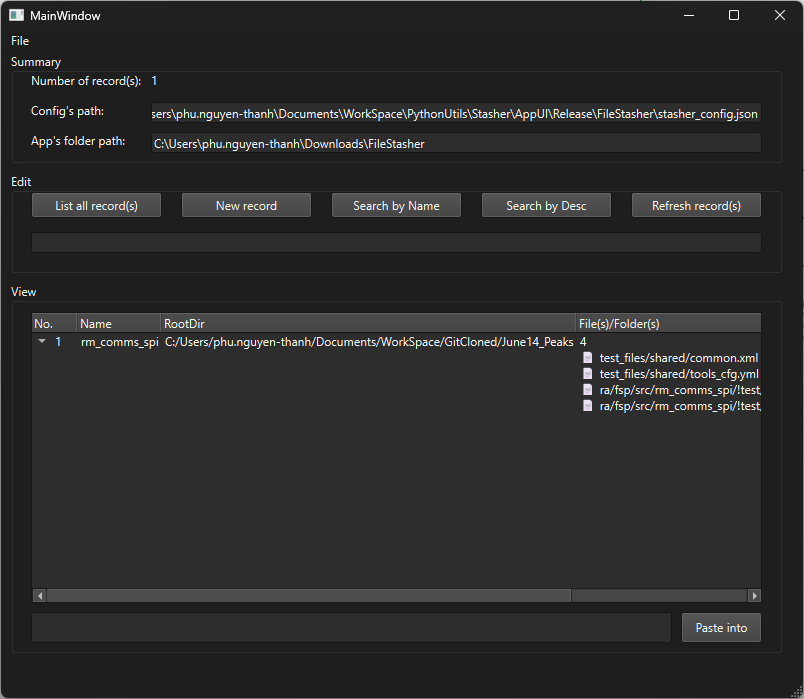
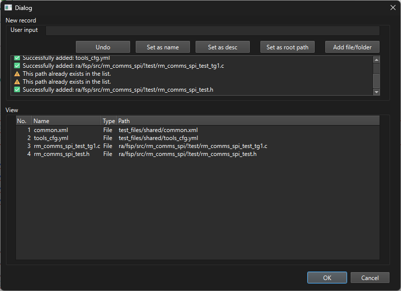
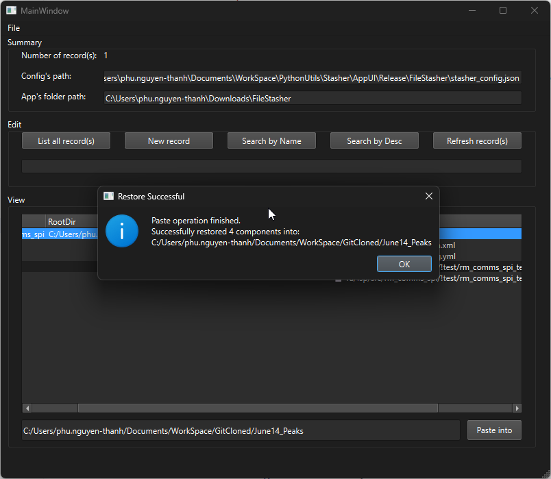

# Table of contents

- [Content table](#content-table)
- [About](#about)
- [Directory tree](#directory-tree)
- [Install](#install)
    - [Option 1: Use the pre-packaged version (Portable EXE - Recommended)](#option-1-use-the-pre-packaged-version-portable-exe---recommended)
    - [Option 2: Run the Graphical User Interface (GUI) from Python source code](#option-2-run-the-graphical-user-interface-gui-from-python-source-code)
    - [Option 3: Use the Command Line Interface version (CLI/CMD)](#option-3-use-the-command-line-interface-version-clicmd)
- [User Guide](#user-guide)
  - [1. Configure the Storage Path](#1-configure-the-storage-path)
  - [2. Using the Graphical Interface (AppUI)](#2-using-the-graphical-interface-appui)
    - [Create a new stash record:](#create-a-new-stash-record)
    - [Restore data (Paste/Unstash):](#restore-data-pasteunstash)
  - [3. Using the Command Line version (AppCMD)](#3-using-the-command-line-version-appcmd)
- [Preview](#preview)
  - [AppUI](#appui)


# About

Supports recursive file/folder copying with structure preservation. Includes a 'stash' feature for temporary file storage, `mimicking` git stash behavior.

# Directory tree

```
.Stasher
|   readme.md
|
+---.imgs
|       AppUI_AddNewRecord.png
|       AppUI_MainWindow.png
|       AppUI_PasteIntoFolder.png
|
+---AppCMD
|   |   FileParser.py
|   |   stasher_config.json
|   |
|   \---Record_2026_June_15_140619
|
\---AppUI
    +---Release
    |   \---FileStasher
    |           FileStasher.exe
    |           stasher_config.json
    |
    \---Source
        |   requirements.txt
        |   stasher.ui
        |   stasher_config.json
        |   stasher_main.py
        |   stasher_newrecord.ui
        |   stasher_newrecord_ui.py
        |   stasher_ui.py
        \---__pycache__

```

# Install

You can choose to use **FileStasher** in one of the 3 ways below depending on your needs:

### Option 1: Use the pre-packaged version (Portable EXE - Recommended)

No need to install Python or any libraries, just download and run instantly.

1. Navigate to the directory path: `.Stasher/AppUI/Release/FileStasher/`
2. Launch the `FileStasher.exe` file.

### Option 2: Run the Graphical User Interface (GUI) from Python source code

If you want to modify the code or run it directly using a Python environment:

1. Ensure your computer has **Python 3.10+** installed.
2. Open Terminal/CMD at the directory `.Stasher/AppUI/Source/`.
3. Install the required libraries:

```pwsh
pip install -r requirements.txt
```

4. Launch the application:

```pwsh
python stasher_main.py
```

### Option 3: Use the Command Line Interface version (CLI/CMD)

If you prefer quick operations using text on the Terminal:

1. Open Terminal/CMD at the directory `Stasher/AppCMD/`.

2. Launch the application:

```pwsh
python FileParser.py
```


# User Guide

## 1. Configure the Storage Path
Before use, the application will automatically generate a configuration file named `stasher_config.json`.

You can open this file and change the value of `"PATH_STORAGE"` to the central directory you want to use as your storage repository (where "stash records" are gathered).

---

## 2. Using the Graphical Interface (AppUI)

### Create a new stash record:
* Click the button to create a new Record to open the **New record** window.
* Select **Set as root path** to set the root directory for the group of files to be saved.
* Click **Add file/folder** to add files or subdirectories to the queue list. After saving, the application automatically copies recursively and preserves your directory structure into the storage repository.
* The status box at the very bottom (**Recently Status**) integrates a circular buffer to help you track real-time copy progress visually.

### Restore data (Paste/Unstash):
* On the main screen (**MainWindow**), right-click on the Record you want to restore.
* Select the **Paste/Restore** feature, and the file structure will automatically replicate exactly at the destination, mimicking the `git stash apply` behavior.

---

## 3. Using the Command Line version (AppCMD)
When running the `FileParser.py` file, the system will display a highly straightforward interactive text menu:

* `l` : List all existing records in the storage repository.
* `sn` / `sd` : Quickly search for a record by Name or Description.
* `ss` : Select a specific record by its index number (No.).

After selecting a record using the `ss` command, you can proceed to type:
* `p` : Execute Paste/Restore to recover the file structure of that record onto the computer.
* `D` : Permanently delete that record from the storage repository.
* `n` : Quickly create a new stash record directly from the command line window.
* `q` : Exit the program.

# Preview

## AppUI



